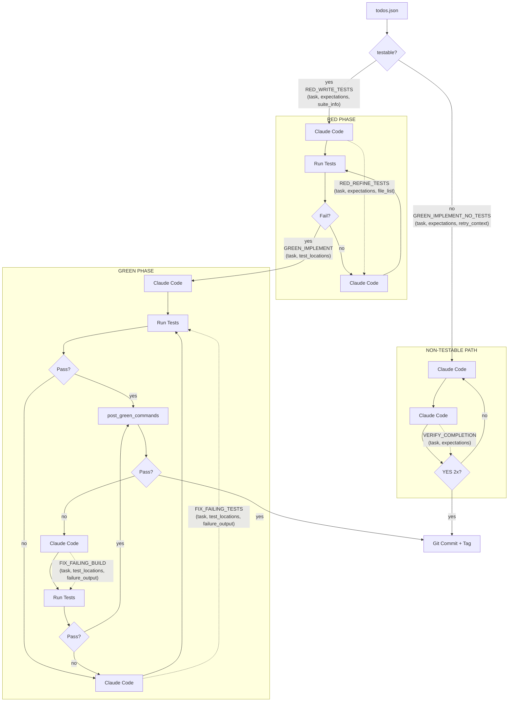

# Chief


**Chief** is an automated TDD (Test-Driven Development) orchestrator that enforces discipline on your coding agent: write failing tests first, then implement, then verify.

This is an implementation of the [Ralph Wiggum method](https://ghuntley.com/ralph/) from Geoffrey Huntley

## How It Works


## ⚠️ Potential Data Loss Warning

**Chief performs destructive Git operations.**

To recover from failed TDD cycles, this tool utilizes `git clean -fd` and `git checkout`. It assumes it is the sole actor in the repository during execution.

* **Start Clean:** Ensure you have no uncommitted changes or untracked files before running.
* **Hands Off:** Do not modify files manually while the script is active.
* **Data Loss:** Any file created or modified manually during a Chief run runs a high risk of being deleted if the agent triggers a rollback.


## Quick Start

### 1. Copy `chief.py` to your project

Chief is a single self-contained file with no dependencies beyond Python 3.11+ stdlib. Just copy it into your codebase:

```bash
cp chief.py /path/to/your/project/
```

### 2. Create your config file (`chief.toml`)

See `chief.toml.example` for more examples. Here's a minimal config:

```toml
[[suites]]
name = "backend"
language = "Python"
framework = "pytest"
root = "."
command = "pytest {target} -v"
target_type = "file"
file_patterns = ["test_*.py", "*_test.py"]
disallow_write_globs = ["tests/**", "test_*.py"]
```

### 3. Create your task list (`todos.json`)

See `todos.json.example` for reference. Here's a sample:

```json
{
  "todos": [
    {
      "todo": "Add user authentication with JWT tokens",
      "priority": 10,
      "expectations": "Users can login and receive a JWT token for subsequent API calls"
    },
    {
      "todo": "Implement rate limiting for API endpoints",
      "priority": 5
    }
  ]
}
```

### 4. Run Chief

```bash
python chief.py
```

Or in quiet mode:

```bash
python chief.py --quiet
# or
CHIEF_QUIET=1 python chief.py
```

## Optional: Claude Code Commands

Chief includes optional Claude Code slash commands that help manage your `todos.json`. To use them, symlink the `.claude` directory and example files into your project:

```bash
ln -s /path/to/chief/.claude /path/to/your/project/.claude
ln -s /path/to/chief/todos.json.example /path/to/your/project/todos.json.example
ln -s /path/to/chief/chief.toml.example /path/to/your/project/chief.toml.example
```

This gives you access to:

| Command | Description |
|---------|-------------|
| `/req <requirements>` | Break down requirements into todos and add them to `todos.json` |
| `/reprio` | Reprioritize todos based on recent project activity |
| `/prd <prd text>` | Generate project scaffolding and create todos from a PRD |

The commands reference the example files to understand the schema, so all three symlinks are needed.

## Features

- **Multi-Suite Support** - Handle monorepos with multiple languages/frameworks
- **Automatic Environment Setup** - Optional `init` commands for venvs, npm install, etc.
- **Pre-Test Setup** - Optional `setup` commands (Docker, test data seeding)
- **Test File Protection** - Prevents Claude from modifying tests during implementation
- **Smart Recovery** - Automatic retry loops with rollback on failure
- **Git Integration** - Auto-commit and tag on successful completion
- **Priority Queue** - Process todos by priority (highest first)

## Configuration Reference

### Suite Options

| Field | Required | Description |
|-------|----------|-------------|
| `name` | Yes | Unique identifier for the suite |
| `language` | Yes | Programming language (Python, TypeScript, Go, etc.) |
| `framework` | Yes | Test framework (pytest, Jest, Vitest, go test, etc.) |
| `root` | Yes | Root directory for this suite |
| `command` | Yes | Test command. Use `{target}` for the test file/path |
| `target_type` | Yes | One of: `file`, `package`, `project`, `repo` |
| `file_patterns` | No | Glob patterns for test files |
| `disallow_write_globs` | No | Patterns for files Claude cannot modify |
| `init` | No | Command to initialize dev environment |
| `setup` | No | Command to run before tests (once per suite) |
| `env` | No | Environment variables for commands |

### Todo Options

| Field | Required | Description |
|-------|----------|-------------|
| `todo` | Yes | Description of the task |
| `priority` | No | Higher = processed first (default: 0) |
| `expectations` | No | Expected outcome (1-2 sentences) - helps write better tests |
| `testable` | No | Set `false` for non-testable tasks (docs, prompts). Uses file-change verification instead of tests (default: true) |
| `done_at_commit` | Auto | Set by Chief when completed |

## Examples

See `chief.toml.example` for configuration examples including:
- Python + pytest (with pyenv)
- TypeScript + Jest/Vitest
- Go + go test
- Rust + cargo test
- Ruby + RSpec
- Java + JUnit
- Multi-suite monorepo setups

## License

MIT
